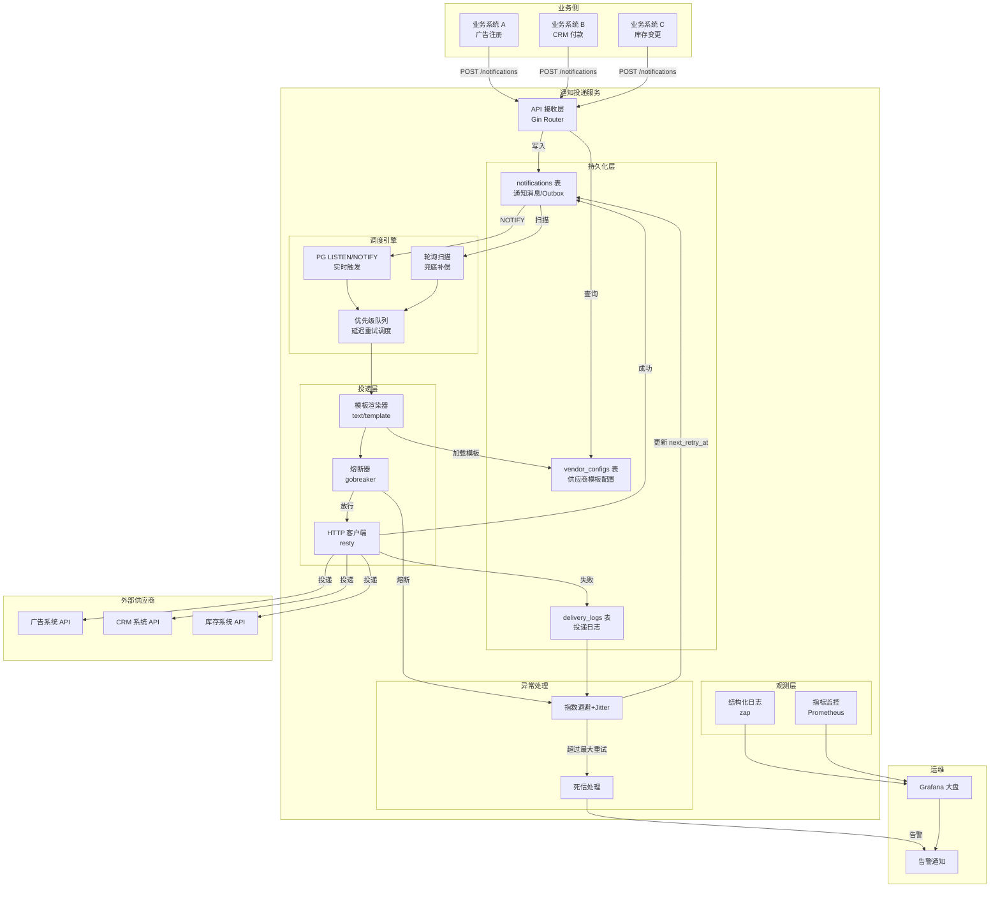

# 系统架构总览

```mermaid
graph TB
    subgraph 业务侧
        BizA[业务系统 A<br/>广告注册]
        BizB[业务系统 B<br/>CRM 付款]
        BizC[业务系统 C<br/>库存变更]
    end

    subgraph 通知投递服务
        API[API 接收层<br/>Gin Router]

        subgraph 持久化层
            NT[notifications 表<br/>通知消息/Outbox]
            DL[delivery_logs 表<br/>投递日志]
            VC[vendor_configs 表<br/>供应商模板配置]
        end

        subgraph 调度引擎
            PG_LN[PG LISTEN/NOTIFY<br/>实时触发]
            POLL[轮询扫描<br/>兜底补偿]
            PQ[优先级队列<br/>延迟重试调度]
        end

        subgraph 投递层
            REND[模板渲染器<br/>text/template]
            CB[熔断器<br/>gobreaker]
            HTTP[HTTP 客户端<br/>resty]
        end

        subgraph 异常处理
            BACKOFF[指数退避+Jitter]
            DEAD[死信处理]
        end

        subgraph 观测层
            LOG[结构化日志<br/>zap]
            METRICS[指标监控<br/>Prometheus]
        end
    end

    subgraph 外部供应商
        V1[广告系统 API]
        V2[CRM 系统 API]
        V3[库存系统 API]
    end

    subgraph 运维
        GRAFANA[Grafana 大盘]
        ALERT[告警通知]
    end

    BizA & BizB & BizC -->|POST /notifications| API
    API -->|写入| NT
    API -->|查询| VC
    NT -->|NOTIFY| PG_LN
    NT -->|扫描| POLL
    PG_LN & POLL --> PQ
    PQ --> REND
    REND -->|加载模板| VC
    REND --> CB
    CB -->|放行| HTTP
    CB -->|熔断| BACKOFF
    HTTP -->|投递| V1 & V2 & V3
    HTTP -->|成功| NT
    HTTP -->|失败| DL
    DL --> BACKOFF
    BACKOFF -->|更新 next_retry_at| NT
    BACKOFF -->|超过最大重试| DEAD
    DEAD -->|告警| ALERT

    LOG & METRICS --> GRAFANA
    GRAFANA --> ALERT
```
