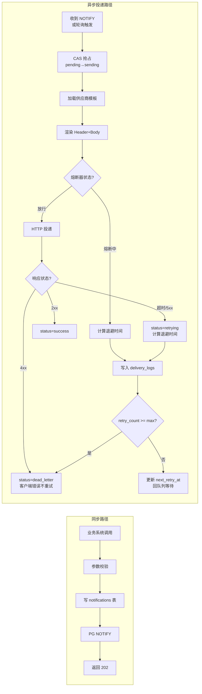

# 核心流程架构

## 同步路径（提交流程）

业务系统调用 → 参数校验 → 写 notifications 表 → PG NOTIFY → 返回 202

## 异步投递路径

```mermaid
flowchart LR
    subgraph 同步路径
        A1[业务系统调用] --> A2[参数校验] --> A3[写 notifications 表] --> A4[PG NOTIFY] --> A5[返回 202]
    end

    subgraph 异步投递路径
        B1[收到 NOTIFY<br/>或轮询触发] --> B2[CAS 抢占<br/>pending→sending] --> B3[加载供应商模板] --> B4[渲染 Header+Body]
        B4 --> B5{熔断器状态?}
        B5 -->|放行| B6[HTTP 投递]
        B5 -->|熔断中| B7[计算退避时间]
        B6 --> C1{响应状态?}
        C1 -->|2xx| C2[status=success]
        C1 -->|超时/5xx| C3[status=retrying<br/>计算退避时间]
        C1 -->|4xx| C4[status=dead_letter<br/>客户端错误不重试]
        B7 --> B8[写入 delivery_logs]
        C3 --> B8
        B8 --> B9{retry_count >= max?}
        B9 -->|否| B10[更新 next_retry_at<br/>回队列等待]
        B9 -->|是| C4
    end
```
