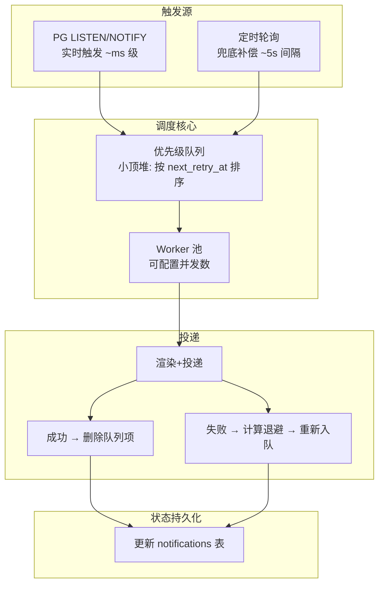

# 调度引擎架构

```mermaid
flowchart TB
    subgraph 触发源
        T1[PG LISTEN/NOTIFY<br/>实时触发 ~ms 级]
        T2[定时轮询<br/>兜底补偿 ~5s 间隔]
    end

    subgraph 调度核心
        T1 & T2 --> Q[优先级队列<br/>小顶堆: 按 next_retry_at 排序]
        Q --> W[Worker 池<br/>可配置并发数]
    end

    subgraph 投递
        W --> D1[渲染+投递]
        D1 --> R1[成功 → 删除队列项]
        D1 --> R2[失败 → 计算退避 → 重新入队]
    end

    subgraph 状态持久化
        R1 & R2 --> DB[更新 notifications 表]
    end
```
