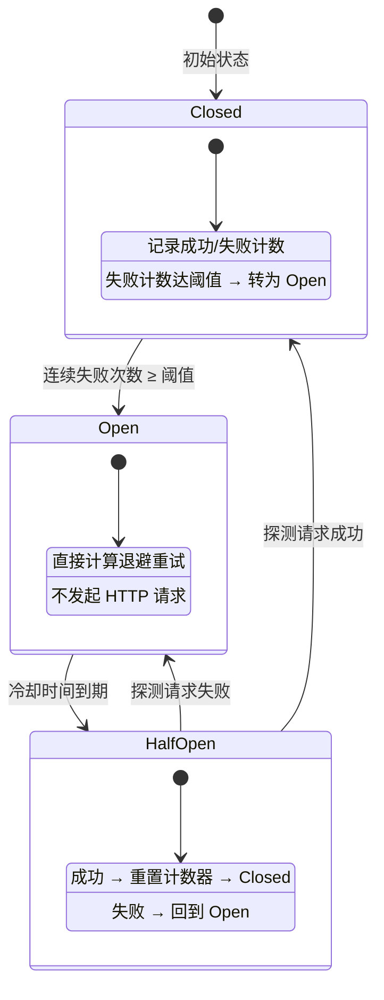
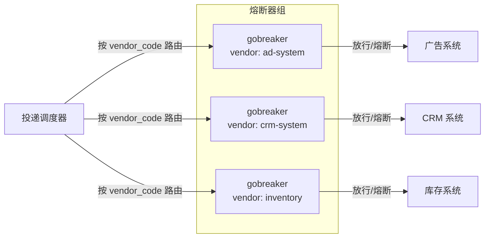

# 熔断器架构

## 熔断器状态机

```mermaid
stateDiagram-v2
    [*] --> Closed : 初始状态
    Closed --> Open : 连续失败次数 ≥ 阈值
    Open --> HalfOpen : 冷却时间到期
    HalfOpen --> Closed : 探测请求成功
    HalfOpen --> Open : 探测请求失败

    state Closed {
        [*] --> 正常投递
        正常投递 : 记录成功/失败计数
        正常投递 : 失败计数达阈值 → 转为 Open
    }

    state Open {
        [*] --> 拒绝投递
        拒绝投递 : 直接计算退避重试
        拒绝投递 : 不发起 HTTP 请求
    }

    state HalfOpen {
        [*] --> 放行1个探测请求
        放行1个探测请求 : 成功 → 重置计数器 → Closed
        放行1个探测请求 : 失败 → 回到 Open
    }
```

## 每供应商独立熔断

```mermaid
graph LR
    subgraph 熔断器组
        CB1[gobreaker<br/>vendor: ad-system]
        CB2[gobreaker<br/>vendor: crm-system]
        CB3[gobreaker<br/>vendor: inventory]
    end

    DISP[投递调度器] -->|按 vendor_code 路由| CB1 & CB2 & CB3
    CB1 -->|放行/熔断| V1[广告系统]
    CB2 -->|放行/熔断| V2[CRM 系统]
    CB3 -->|放行/熔断| V3[库存系统]
```
