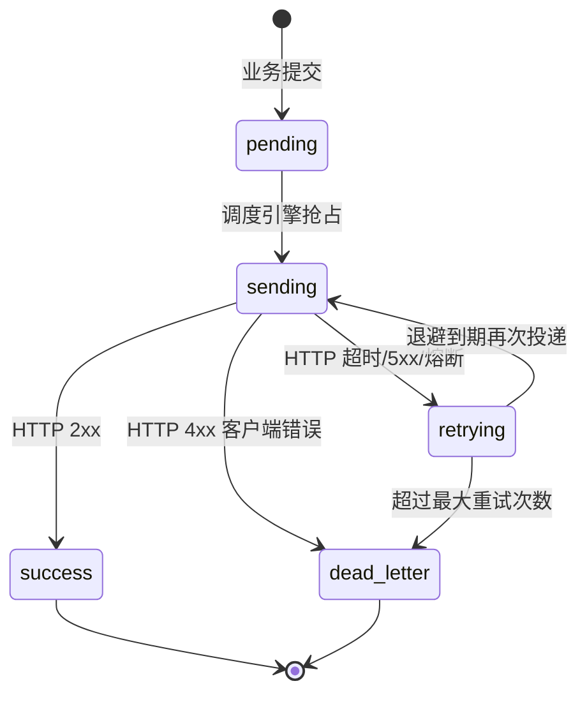

# 投递状态机

## 状态说明

| 状态 | 含义 | 触发条件 |
|---|---|---|
| pending | 已接收，等待投递 | 业务系统提交后初始状态 |
| sending | 正在投递中 | 调度引擎 CAS 抢占成功 |
| success | 投递成功 | 外部系统返回 2xx |
| retrying | 等待下次重试 | 外部系统超时/5xx，或熔断中 |
| dead_letter | 终态，投递失败 | 超过最大重试次数，或 4xx 客户端错误 |
