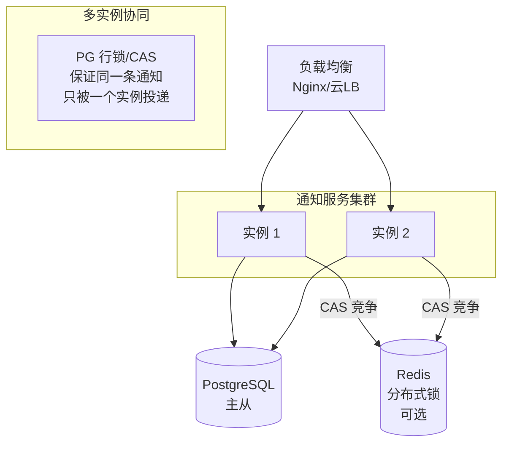

# 部署架构



## 多实例并发安全

调度引擎在多实例部署时，通过 PG 行级 CAS 保证同一条通知只被一个实例投递：

```sql
UPDATE notifications
SET status = 'sending', updated_at = now()
WHERE id = $1 AND status = 'pending'
RETURNING *;
```

- 只有匹配到 `status = 'pending'` 的实例才能获得该通知的投递权
- 其他实例的 UPDATE 影响 0 行，自然跳过
